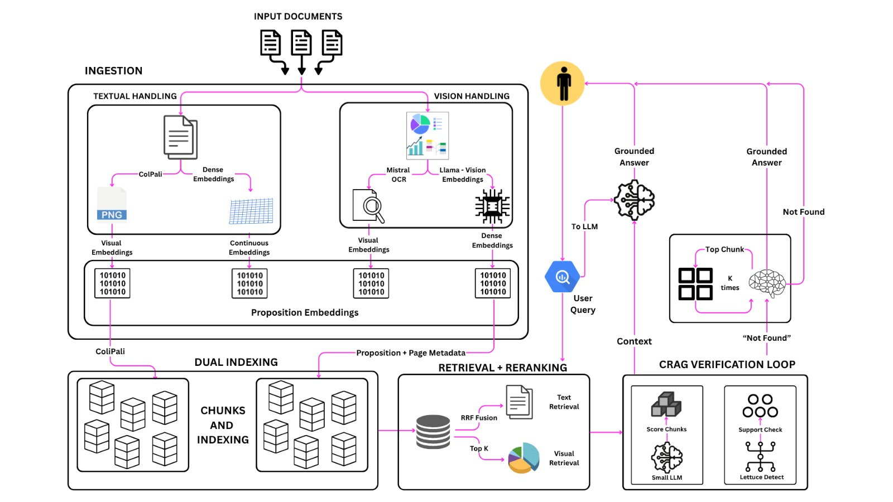

# Pramana
It is a 100% Hallucination free, Explainable RAG Chatbot for Documents of Utmost priority.

The core innovation lies in the model architecture of 3 step verification pipeline for hallucination check, RAPTOR based indexing for summarised as well as specific retrieval and more importantly it is able to find the information from the images, infographics, as well as understand the relations between the graphs, charts and understand the deeper meaning and layout awareness in flowcharts and tables.

PowerMind is a multimodal Retrieval-Augmented Generation (RAG) assistant for asking grounded questions over business documents, PDFs, presentations, reports, and visually rich pages. It combines text extraction, vision-based page understanding, vector search, and LLM generation so users can upload documents and get answers with source-backed evidence.

This project was made for Adani Group under the Powermind Hackathon at Sardar Vallabhbhai National Institute of Technology.


## Project Links

- [Presentation](Presentation.pdf)
- [Architecture Diagram](Architecture.jpeg)



## What It Does

PowerMind lets users upload documents and ask questions in a chat interface. The system indexes both normal document text and visual page content, retrieves the most relevant chunks for a question, and generates a concise answer grounded only in the retrieved context.

It is designed for documents where important information may appear in more than one form:

- Plain text in PDFs, TXT files, or DOCX files
- Tables and financial figures
- Charts, infographics, screenshots, and page visuals
- Presentation slides where visual layout carries meaning

## Why Multimodal RAG

Traditional RAG works well when the answer is present as clean selectable text. Many real business PDFs and decks are not that simple: numbers may live inside charts, tables may extract poorly, and important labels may appear only in images.

PowerMind handles this by creating separate retrieval channels:

- `text`: extracted with normal document parsers such as `pdfplumber`
- `vlm`: extracted from rendered PDF pages using a vision model
- `raptor_summary`: hierarchical summaries built over lower-level chunks for broader retrieval

These channels are stored together in the same vector store, but each vector keeps metadata such as `embedding_channel`, `page_number`, `chunk_index`, `document_id`, and `filename`. This allows retrieval to search across text and visual evidence while still knowing where each answer came from.

## High-Level Architecture

The repository has three main parts:

- `frontend/`: Next.js chat and upload UI
- `backend/`: FastAPI app, document ingestion, RAG v2 graph, SQLite records, and Pinecone/local vector store integration
- `service/`: multimodal RAG package with indexing, retrieval, verification, and CLI utilities

At a high level:

1. A user uploads a document from the frontend.
2. The backend stores file metadata in SQLite.
3. The ingestion pipeline extracts normal text from the document.
4. For PDFs, pages can also be rendered and analyzed by a vision model.
5. Text and visual outputs are chunked and embedded.
6. Vectors are stored in Pinecone, or in a local JSONL cache for offline/local use.
7. When a user asks a question, LangGraph runs retrieval and generation.
8. The answer is generated from retrieved context only, with citations and source metadata.

## Storage Model

PowerMind uses two kinds of storage because they solve different problems.

### SQLite

SQLite is the application database. It lives at:

```text
backend/powermind.db
```

It stores app-level records:

- Chat sessions
- Chat messages
- Uploaded file records
- File paths, statuses, document IDs, and ingest errors

### Pinecone or Local Vector Cache

The vector store is used for semantic retrieval. It stores document embeddings and chunk metadata.

Default cloud storage:

```text
Pinecone index: powermind-rag
Pinecone namespace: default
```

Local cache path:

```text
backend/pinecone_exports/vectors.jsonl
```

The local cache is useful when `POWERMIND_V2_VECTOR_STORE=local`, or when `auto` mode detects an existing export file.

## RAG v2 Pipeline

Important backend files:

- `backend/app/rag_v2/ingestor.py`: parses, chunks, embeds, and upserts document vectors
- `backend/app/rag_v2/vector_store.py`: wraps Pinecone and the local JSONL vector cache behind one API
- `backend/app/rag_v2/graph.py`: LangGraph retrieval and answer-generation flow
- `backend/app/rag_v2/config.py`: environment-driven RAG configuration
- `backend/app/routers/ingest_v2.py`: file ingestion endpoints
- `backend/app/routers/chat_v2.py`: chat endpoints using RAG v2

The main graph is intentionally simple:

```text
retrieve -> generate
         -> fallback, when no chunks are found
```

During retrieval, the question is embedded and matched against the vector store. The graph can expand page context, prioritize explicitly requested pages, and give visual chunks priority for visual questions.

## Tech Stack

- Frontend: Next.js 14, React 18, TypeScript, Tailwind CSS
- Backend: FastAPI, SQLAlchemy, LangGraph
- Retrieval: Pinecone or local JSONL vector cache
- Embeddings: sentence-transformers
- Document parsing: pdfplumber, python-docx
- Vision extraction: configurable VLM provider
- Generation: configurable LLM provider such as Groq, NVIDIA, Gemini, or OpenRouter
- Verification: CRAG-style answer checking with page-level fallback

## Repository Structure

```text
PowerMind/
+-- Architecture.jpeg
+-- Presentation.pdf
+-- backend/
|   +-- app/
|   |   +-- rag_v2/
|   |   +-- routers/
|   |   +-- services/
|   |   +-- database.py
|   |   +-- models.py
|   +-- data/
|   +-- pinecone_exports/
|   +-- scripts/
+-- frontend/
|   +-- app/
|   +-- components/
|   +-- lib/
+-- service/
|   +-- src/powermind_rag/
+-- scripts/
```

## Getting Started

### Backend

From the backend directory:

```bash
cd backend
uv sync
uv run fastapi dev app/main.py
```

The backend reads configuration from `backend/.env`.

Common environment values include:

```text
PINECONE_API_KEY=
PINECONE_INDEX_NAME=powermind-rag
PINECONE_NAMESPACE=default
POWERMIND_V2_VECTOR_STORE=auto
POWERMIND_V2_LOCAL_VECTOR_PATH=backend/pinecone_exports/vectors.jsonl
POWERMIND_GENERATION_PROVIDER=groq
GROQ_API_KEY=
```

### Frontend

From the frontend directory:

```bash
cd frontend
npm install
npm run dev
```

Then open:

```text
http://localhost:3000
```

## Useful Scripts

- `backend/scripts/run_v2_data_ingest.py`: ingest documents into the RAG v2 vector store
- `backend/scripts/export_pinecone_vectors.py`: export Pinecone vectors to local JSONL
- `backend/scripts/run_tests_json.py`: run configured QA tests
- `scripts/smoke_full_pipeline.py`: smoke test the full pipeline

## Notes

PowerMind is built to answer from documents, not from model memory. If the retrieved context does not support an answer, the assistant is instructed to return:

```text
Not found in the Documents
```

This makes the system more useful for financial, presentation, and document-heavy workflows where traceability matters.
